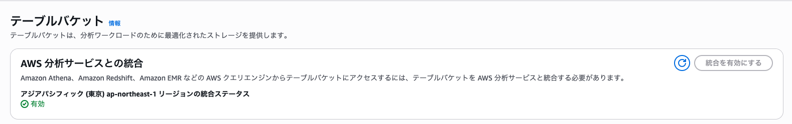

# デプロイ手順

## 事前準備

### 環境セットアップ

デプロイには、以下の環境が必要です。事前に環境のセットアップを実施してください。

- **Node.js**: バージョン24以上が必要です
  ```bash
  # Homebrew の場合
  brew install node@24
  # PATH設定（zshの場合）
  echo 'export PATH="/opt/homebrew/opt/node@24/bin:$PATH"' >> ~/.zshrc
  source ~/.zshrc

  # nvm の場合
  nvm install 24
  nvm use 24
  ```
- **AWS CLI**: AWSリソースの管理に使用します
- **AWS CDK**: インフラストラクチャのプロビジョニングに使用します
  ```bash
  npm install -g aws-cdk
  ```
- **AWS認証情報の設定**: AWSの認証情報を`$HOME/.aws/config`に設定してください
-  **Docker**: docker コマンドを実行できる状態に環境をセットアップしてください。Docker Desktop を業務利用する場合は多くの場合 [サブスクリプション契約が必要](https://www.docker.com/legal/docker-subscription-service-agreement/) ですのでご注意ください。
	- CDK デプロイ時はコンテナを AWS CodeBuild で build するため Docker なしでもアプリの利用は可能です。
	- Local 環境での API テストを docker 上で行うため、継続的な開発を行う際に必要になります。
- **Python**: バージョン3.13が必要です（バックエンドAPI用）
- **uv**: Pythonパッケージ管理に使用します
  ```bash
  curl -LsSf https://astral.sh/uv/install.sh | sh
  ```

> [!NOTE]
> デプロイ先のAWSアカウントとリージョンを事前に決定してください。デフォルトリージョンは`ap-northeast-1`です。

### AWS環境
- 該当リージョンで Bedrock モデルが利用できることを事前にコンソールなどから確認ください。（ cdk/lib/constructs/agentcore-resources.ts 内の agentcore runtime 環境変数設定から変更可能 ）
	- デフォルトリージョン: `ap-northeast-1`
	- デフォルトモデル: `jp.anthropic.claude-haiku-4-5-20251001-v1:0`
- API Gateway の [Timeout Quota （`Maximum integration timeout in milliseconds`）](https://ap-northeast-1.console.aws.amazon.com/servicequotas/home/services/apigateway/quotas/L-E5AE38E3)の緩和申請を実施ください
	- AWS のデフォルトのクォータ値: 29,000 ミリ秒
	- 緩和申請値: 90,000 ミリ秒
- S3 Tables AWS 分析サービスとの統合

[S3 tables コンソール画面](https://ap-northeast-1.console.aws.amazon.com/s3/table-buckets?region=ap-northeast-1)から統合を有効化

## デプロイ手順

### 1. プロジェクトの取得

#### Git Clone の場合
```bash
git clone https://github.com/aws-samples/sample-store-manager-agent-for-retail-tech.git
cd sample-store-manager-agent-for-retail-tech/
```

#### ZIP の場合
```bash
unzip sample-store-manager-agent-for-retail-tech.zip
cd sample-store-manager-agent-for-retail-tech/
```
> [!NOTE]
> GitHub の「Download ZIP」で取得した場合、フォルダ名が `sample-store-manager-agent-for-retail-tech-main` のようにブランチ名が付くことがあります。適宜読み替えてください。

### 2. CDK環境の準備

#### npm モジュールインストール
```bash
cd cdk
npm install
```

#### CDK Bootstrap

> [!IMPORTANT]
> 初回デプロイ時のみ、CDK Bootstrapが必要です。2つのリージョンで実行します。
> `us-east-1` は CloudFront に紐づく WAF（WebACL）のデプロイ先として必要です。

```bash
AWS_REGION=ap-northeast-1 npx cdk bootstrap
AWS_REGION=us-east-1 npx cdk bootstrap
```

#### Lake Formation 設定

CDK デプロイで S3 Tables / Iceberg リソースを作成するため、Lake Formation のデータレイク管理者に以下の2つのプリンシパルを追加する必要があります。

> [!NOTE]
> Lake Formation は IAM とは独立した権限モデルを持っています。IAM の AdministratorAccess があっても、Lake Formation のデータレイク管理者として明示的に登録されていない限り、Lake Formation リソースへのアクセスは制限されます。

##### 1. 自分の IAM プリンシパルの確認

```bash
aws sts get-caller-identity --query "Arn" --output text
```

出力例（IAM ユーザーの場合）:
```
arn:aws:iam::<YOUR_ACCOUNT_ID>:user/<YOUR_IAM_USERNAME>
```

出力例（IAM ロール経由の場合）:
```
arn:aws:sts::<YOUR_ACCOUNT_ID>:assumed-role/<YOUR_ROLE_NAME>/session-name
```
→ この場合のロール ARN は `arn:aws:iam::<YOUR_ACCOUNT_ID>:role/<YOUR_ROLE_NAME>`

##### 2. CDK cfn-exec-role の確認

CDK Bootstrap で自動作成されるロールを確認します。

```bash
aws iam list-roles \
  --query "Roles[?starts_with(RoleName, 'cdk-') && contains(RoleName, 'cfn-exec')].{RoleName:RoleName,Arn:Arn}" \
  --output table
```

##### 3. Lake Formation 管理者の設定

IAM ユーザーを直接使っている場合:
```bash
aws lakeformation put-data-lake-settings \
  --region ap-northeast-1 \
  --data-lake-settings '{
    "DataLakeAdmins": [
      {"DataLakePrincipalIdentifier": "arn:aws:iam::<YOUR_ACCOUNT_ID>:user/<YOUR_IAM_USERNAME>"},
      {"DataLakePrincipalIdentifier": "arn:aws:iam::<YOUR_ACCOUNT_ID>:role/cdk-hnb659fds-cfn-exec-role-<YOUR_ACCOUNT_ID>-ap-northeast-1"}
    ]
  }'
```

IAM ロール経由でアクセスしている場合:
```bash
aws lakeformation put-data-lake-settings \
  --region ap-northeast-1 \
  --data-lake-settings '{
    "DataLakeAdmins": [
      {"DataLakePrincipalIdentifier": "arn:aws:iam::<YOUR_ACCOUNT_ID>:role/<YOUR_ROLE_NAME>"},
      {"DataLakePrincipalIdentifier": "arn:aws:iam::<YOUR_ACCOUNT_ID>:role/cdk-hnb659fds-cfn-exec-role-<YOUR_ACCOUNT_ID>-ap-northeast-1"}
    ]
  }'
```

##### 4. 設定の確認

```bash
aws lakeformation get-data-lake-settings \
  --region ap-northeast-1 \
  --query "DataLakeSettings.DataLakeAdmins" \
  --output json
```

2つのプリンシパルが表示されれば OK です。

##### AWS コンソールでの追加手順

CLI の代わりにコンソールからも設定できます。

1. [Lake Formation コンソール](https://console.aws.amazon.com/lakeformation/) を開く
2. 左メニューから「Administrative roles and tasks」をクリック
3. 「Data lake administrators」セクションの「Add」をクリック
4. 上記で確認した2つのプリンシパルを追加して「Save」

### 3. CDK設定のカスタマイズ

`cdk/cdk.json`で以下の設定をカスタマイズできます：

```json
{
  "context": {
    "selfSignUpEnabled": true,
    "allowedSignUpEmailDomains": ["example.com"],
    "autoJoinUserGroups": ["admin"],
    "allowedIpV4AddressRanges": ["0.0.0.0/1", "128.0.0.0/1"],
    "allowedIpV6AddressRanges": [
      "0000:0000:0000:0000:0000:0000:0000:0000/1",
      "8000:0000:0000:0000:0000:0000:0000:0000/1"
    ]
  }
}
```

> [!Note]
> - selfSignUpEnabled: アプリ画面でユーザー作成を許可
> - allowedSignUpEmailDomains: サインナップ可能メールアドレス
> - autoJoinUserGroups: 自動追加するUserGroup
> - allowedIpV4AddressRanges: IP制限設定
> - allowedIpV6AddressRanges: IP制限設定

### 4. CDKデプロイ

```bash
cd cdk
npx cdk deploy --all --require-approval never --outputs-file ./.cdk-outputs.json
```

> [!NOTE]
> デプロイには20分程度かかります。以下のリソースが作成されます：
> - S3（バケットストレージ）
> - S3 Tables（データストレージ）
> - Amazon Athena（データクエリ）
> - AgentCore Runtime（AIエージェント実行環境）
> - AgentCore Memory（会話履歴管理）
> - Lambda関数（API処理）
> - API Gateway（REST API）
> - Amazon Cognito（認証）
> - CloudFront（フロントエンド配信）

### 5. 初期データのセットアップ

デプロイ完了後、初期データをS3 Tablesに投入します。

```bash
cd ../data-import
uv sync
```

> [!NOTE]
> AWS SSO（`aws sso login`）経由の認証を使っている場合、以下の追加インストールが必要です。IAM アクセスキーを直接設定している場合は不要です。
> ```bash
> uv pip install "botocore[crt]"
> ```
> これがないと、`uv run s3_transfer.py` 等の実行時に以下のエラーが発生します:
> ```
> botocore.exceptions.MissingDependencyException: Missing Dependency: Using the login credential provider requires an additional dependency.
> ```
> `botocore[crt]` をインストールすると、AWS CRT（Common Runtime）ライブラリが追加され、SSO のトークンベース認証が正しく処理されるようになります。

1. 設定ファイル作成
```bash
uv run generate_config.py
```

2. テストデータ解凍（フォルダ・データ構造を参考にお客様データに変更してください）
```bash
unzip test-data.zip
```

3. CSVデータ転送
```bash
uv run s3_transfer.py
```

4. テーブル作成
```bash
uv run create_s3_tables.py
```

5. テスト用前日survey+売上サンプルデータ追加
```bash
uv run insert_s3_tables_test_data.py
```

> [!IMPORTANT]
> この処理では以下のテーブルが作成され、初期データが投入されます：
> - `admin_survey`: アンケート質問マスタ
> - `admin_messages`: システムメッセージマスタ
> - `daily_survey_answers`: アンケート回答データ
> - `daily_survey_summary`: 日次サマリーデータ
> - `ai_chat_history`: AI対話履歴
> - `m_item`: 商品マスタ
> - `t_sales`: 売上データ
> - `t_daily_store_traffic`: 来客数データ
> - `t_str_daily_budget`: 予算データ

### 6. デプロイ確認

デプロイが成功したことを確認します。

```bash
# CDK出力の確認
cat cdk/.cdk-outputs.json
```

CloudFormationの出力から以下の情報を取得できます：
- `FrontendFrontendUrlE3736ECE`: フロントエンドアプリケーションのURL
- `ApiLambdaApiEndpoint*`: REST APIのエンドポイント
- `UserPoolId`: Cognito User Pool ID
- `UserPoolClientId`: Cognito User Pool Client ID

### 7. ユーザー作成

初回ログイン用のユーザーを作成します。

```bash
aws cognito-idp admin-create-user \
  --user-pool-id <USER_POOL_ID> \
  --username <EMAIL> \
  --user-attributes Name=email,Value=<EMAIL> Name=email_verified,Value=true \
  --temporary-password <TEMP_PASSWORD>
```

> [!TIP]
> `selfSignUpEnabled: true`の場合、ユーザーはフロントエンドから自己登録できます。

### 8. adminグループへのユーザー追加

管理機能（アンケート質問の編集、メッセージ管理など）を使用するには、ユーザーを `admin` グループに追加する必要があります。

```bash
aws cognito-idp admin-add-user-to-group \
  --user-pool-id <USER_POOL_ID> \
  --username <EMAIL> \
  --group-name admin
```

> [!NOTE]
> グループ追加後、アプリケーションから一度サインアウトし、再度サインインしてください。サインイン後、画面上部にadminグループ表示とadminメニューが表示されます。

## デプロイ失敗時のリカバリ手順

デプロイが途中で失敗した場合、以下の手順でクリーンアップしてから再デプロイしてください。

### Step 1: 失敗したスタックの削除

```bash
cd cdk
npx cdk destroy BackendStack --force
```

### Step 2: 残留リソースの確認と削除

`cdk destroy` では削除されない RETAIN 指定のリソースが残ります。

#### Cognito User Pool

```bash
# 確認
aws cognito-idp list-user-pools --max-results 20 --region ap-northeast-1 \
  --query "UserPools[?contains(Name, 'BackendStack')].{Name:Name,Id:Id}" --output json

# 削除（IDを置き換え）
aws cognito-idp delete-user-pool --user-pool-id <USER_POOL_ID> --region ap-northeast-1
```

#### S3 バケット（3つ）

```bash
# 確認
aws s3api list-buckets \
  --query "Buckets[?contains(Name, 'backendstack') || contains(Name, 'store-manager')].Name" --output json
```

通常のバケット（データソース、Athena結果）:
```bash
aws s3 rb s3://<BUCKET_NAME> --force
```

バージョニング有効バケット（プロンプト）は `--force` だけでは消えません:
```bash
# バージョンとDeleteMarkerを確認
aws s3api list-object-versions --bucket <BUCKET_NAME> --region ap-northeast-1 \
  --query "{Versions:Versions[].{Key:Key,VersionId:VersionId},DeleteMarkers:DeleteMarkers[].{Key:Key,VersionId:VersionId}}"

# バージョンとDeleteMarkerを削除
aws s3api delete-objects --bucket <BUCKET_NAME> --region ap-northeast-1 \
  --delete '{
    "Objects": [
      {"Key": "<KEY>", "VersionId": "<VERSION_ID>"},
      ...
    ]
  }'

# バケット削除
aws s3 rb s3://<BUCKET_NAME>
```

### Step 3: S3 Tables テーブルバケットの待機

前回のスタック削除で S3 Tables のテーブルバケットが「transitional state」になる場合があります。
この状態で再デプロイすると 409 エラーが発生します:
```
The bucket is in a transitional state because of a previous deletion attempt. Try again later.
```

確認方法:
```bash
aws s3tables list-table-buckets --region ap-northeast-1
```

`tableBuckets` が空になるまで数分待ってください（目安: 3〜10分）。

### Step 4: 再デプロイ前の最終確認

以下が全てクリアであることを確認してから再デプロイしてください:

```bash
# 1. スタックが消えているか → [] であること
aws cloudformation list-stacks --region ap-northeast-1 \
  --query "StackSummaries[?StackName=='BackendStack' && StackStatus!='DELETE_COMPLETE'].{Name:StackName,Status:StackStatus}" \
  --output json

# 2. Cognito が残っていないか → [] であること
aws cognito-idp list-user-pools --max-results 20 --region ap-northeast-1 \
  --query "UserPools[?contains(Name, 'BackendStack')]" --output json

# 3. S3 バケットが残っていないか → [] であること
aws s3api list-buckets \
  --query "Buckets[?contains(Name, 'backendstack') || contains(Name, 'store-manager')].Name" --output json

# 4. S3 Tables テーブルバケットが transitional でないか → tableBuckets が空であること
aws s3tables list-table-buckets --region ap-northeast-1
```

### Step 5: 再デプロイ

```bash
cd cdk
npx cdk deploy --all --require-approval never --outputs-file ./.cdk-outputs.json
```

## リソース削除

> [!CAUTION]
> リソース削除は不可逆的な操作です。すべてのデータが失われます。

### S3バケットを空にする

CDKスタック削除前に、S3バケットを空にする必要があります。

```bash
# データソースバケットを空にする
aws s3 rm s3://<DATA_SOURCE_BUCKET_NAME> --recursive

# Athena結果バケットを空にする
aws s3 rm s3://<ATHENA_RESULTS_BUCKET_NAME> --recursive

# フロントエンドバケットを空にする
aws s3 rm s3://<FRONTEND_BUCKET_NAME> --recursive
```

### CDKスタックの削除

```bash
# バックエンドスタックの削除
cd cdk
cdk destroy BackendStack

# WAFスタックの削除（us-east-1）
cdk destroy StoreManagerFrontendWafStack --region us-east-1

# 一括削除
cdk destroy --all
```

> [!WARNING]
> - S3 Tablesのデータを削除すると、すべてのアンケート回答、AI対話履歴、レポートが失われます。必要に応じて事前にバックアップを取得してください。

### 手動削除

以下のリソースについては `cdk destroy` で削除されないため、手動での削除が必要です:

- **S3 バケット**（3つ: データソース、Athena結果、プロンプト）
- **Cognito User Pool**

確認方法:
```bash
# S3 バケット
aws s3api list-buckets \
  --query "Buckets[?contains(Name, 'backendstack') || contains(Name, 'store-manager')].Name" --output json

# Cognito User Pool
aws cognito-idp list-user-pools --max-results 20 --region ap-northeast-1 \
  --query "UserPools[?contains(Name, 'BackendStack')].{Name:Name,Id:Id}" --output json
```

> [!NOTE]
> プロンプトバケット（`store-manager-agent-prompts-*`）はバージョニングが有効なため、`aws s3 rb --force` だけでは削除できません。先に `aws s3api delete-objects` でバージョンと DeleteMarker を削除してからバケットを削除してください。詳細は「デプロイ失敗時のリカバリ手順」の Step 2 を参照してください。
