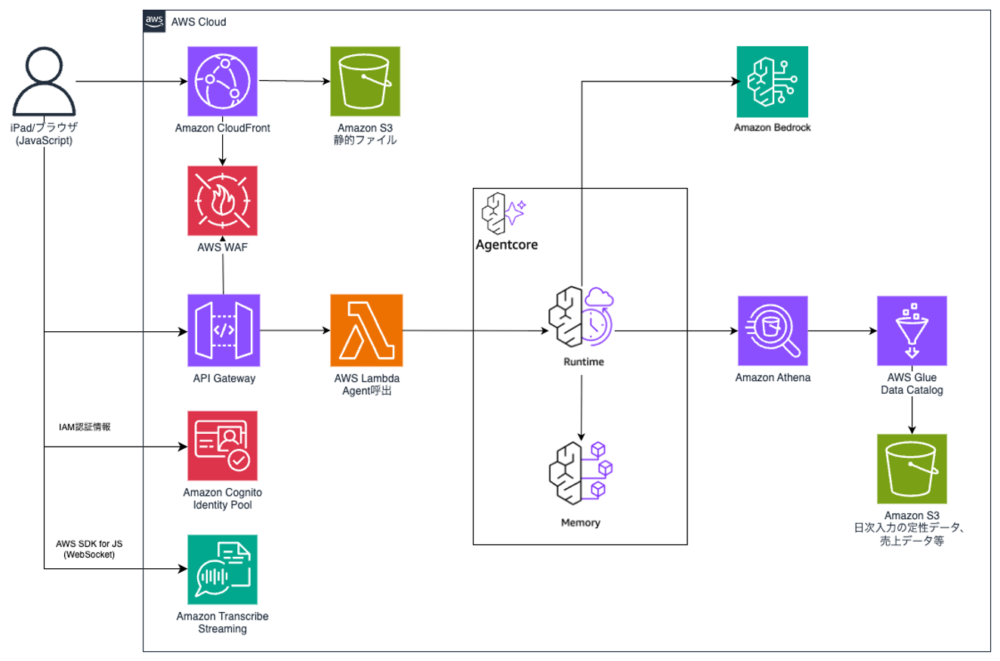

# 開発ガイド

## システムアーキテクチャ

本サンプルは**3層構成**のサーバーレスアーキテクチャを採用しています。

- **データ層**: S3 Tables（Iceberg形式） + Amazon Athena（SQLクエリ）
- **処理層**: Lambda（API処理） + AgentCore Runtime（AIエージェント実行）
- **インターフェース層**: API Gateway（REST API） + CloudFront（フロントエンド配信）

### 処理詳細フロー

1. **ユーザー認証**
   - Amazon Cognitoによる認証・認可
   - JWTトークンベースのセッション管理

2. **日次アンケート回答**
   - フロントエンドから質問項目を取得
   - ユーザーが回答を入力
   - Lambda経由でS3 Tablesに保存

3. **AI対話ヒアリング**
   - AgentCore Runtime上のStrands Agentsによる対話
   - AgentCore Memoryでの会話履歴管理
   - 前日の売上データや過去のアンケート結果を参照
   - 自然な対話形式での追加ヒアリング

4. **レポート生成**
   - Amazon Bedrockによる日次サマリー生成
   - アンケート回答とAI対話内容を統合分析
   - 改善提案の自動生成
   - S3 Tablesへのレポート保存

5. **履歴管理**
   - Amazon Athenaによる過去データのクエリ
   - 日付範囲指定での検索
   - レポートの再生成機能

### 主要コンポーネント

#### ネットワーキング

- **CloudFront**: 
  - フロントエンドアプリケーションの配信
  - グローバルCDNによる高速配信
  - HTTPS通信の強制
  - WAFによるセキュリティ保護

- **API Gateway**:
  - REST APIエンドポイント（REGIONAL型）
  - Cognito Authorizerによる認証
  - WAFによるアクセス制御
  - リクエスト/レスポンスの検証
  - 統合タイムアウト: 90秒（Service Quotaで緩和済み）

- **WAF**:
  - IPアドレスベースのアクセス制御
  - ドメイン制限

#### データベース
S3 TablesはApache Iceberg形式を使用し、トランザクション処理を提供します。

- **S3 Tables**:
  - Iceberg形式のテーブルストレージ
  - スキーマ進化のサポート
  - タイムトラベルクエリ対応
  - 自動圧縮とパーティショニング

- **Amazon Athena**:
  - S3 TablesへのSQLクエリ実行
  - Presto/Trino互換のクエリエンジン
  - パーティションプルーニングによる高速化
  - クエリ結果のS3保存

#### コンピューティング

- **Lambda Functions**:
  - **API Lambda**: FastAPIベースのREST API
    - Runtime: Python 3.13
    - Memory: 512MB
    - Timeout: 90秒
    - MangumによるAPI Gateway統合
  
  - **Cognito Triggers**:
    - Pre Sign Up: メールドメイン検証
    - Post Confirmation: ユーザーグループ自動追加

- **AgentCore Runtime**:
  - Strands Agentsの実行環境
  - サーバーレスでの自動スケーリング
  - 2つのエージェントタイプ:
    - `hearing`: 日次ヒアリングエージェント
    - `daily_summary`: レポート生成エージェント

- **AgentCore Memory**:
  - 会話履歴の永続化
  - セッション管理
  - コンテキスト保持

#### ストレージ

- **S3 Buckets**:
  - **Data Source Bucket**: CSVデータソース（初期データ投入用）
  - **Table Bucket**: S3 Tablesのストレージ
  - **Athena Results Bucket**: Athenaクエリ結果
  - **Frontend Bucket**: フロントエンドアセット
  - **Prompt Bucket**:  Agent System Prompt管理
	  - バージョニング: 有効

## その他

### ユーザー・店舗識別子
- **user_cd**: Cognito の `sub` (UUID) を使用
	- `sub` は作成後変更できず、ユーザーの一意識別子として永続的に使用可能
- **str_cd**: Cognito の `cognito:groups` を使用（例: `admin`, `store_001`）

### ユーザーグループと権限
- Cognito User Pool のグループでユーザーの権限と所属店舗を管理しています
- `admin` グループに所属するユーザーは、管理機能（アンケート質問の編集、メッセージ管理など）にアクセスできます
- 店舗グループ（例: `store_001`）に所属するユーザーは、該当店舗のデータにアクセスできます

### 音声入力
- Amazon Transcribe Streaming を使用したリアルタイム文字起こし機能を提供しています
- Cognito Identity Pool 経由で認証済みユーザーに Transcribe Streaming の権限を付与しています
- フロントエンドでは AudioWorklet を使用し、ブラウザのマイクから取得した音声をリアルタイムで Transcribe に送信します
- 対応言語: 日本語（`ja-JP`）

### Agent
#### System Prompt 更新
- System Prompt を柔軟に更新できるように、**Prompt Bucket** で Agent の System Prompt を管理しています。 Local などで Prompt Text を修正いただき、Prompt Bucket にアップロードいただくことで自動的に Prompt を更新することができます。また、 S3 のバージョン機能も有効化しているため、過去の修正履歴なども保持されます。

#### Tool 追加
- 現在売上情報など、Agent が S3 tables から取得する処理は Tool 内で固定の SQL を実行することで実装しています。Tool は関数 docstring の説明を参考に Agent側が自動的に利用を判断しデータ取得が実行されます。
- 今後 Item 情報など、DBから取得するデータを追加したい場合は、既存の Tool 実装を参考に Tool を追加し SQL を修正いただくことでデータを増やすことができます。

